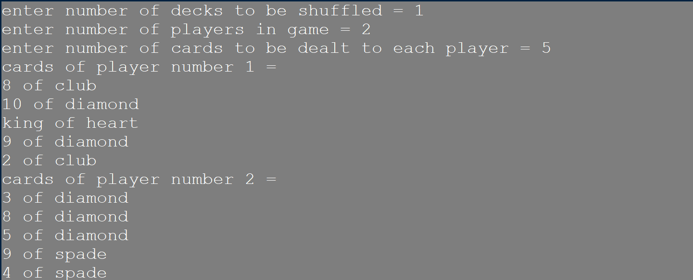
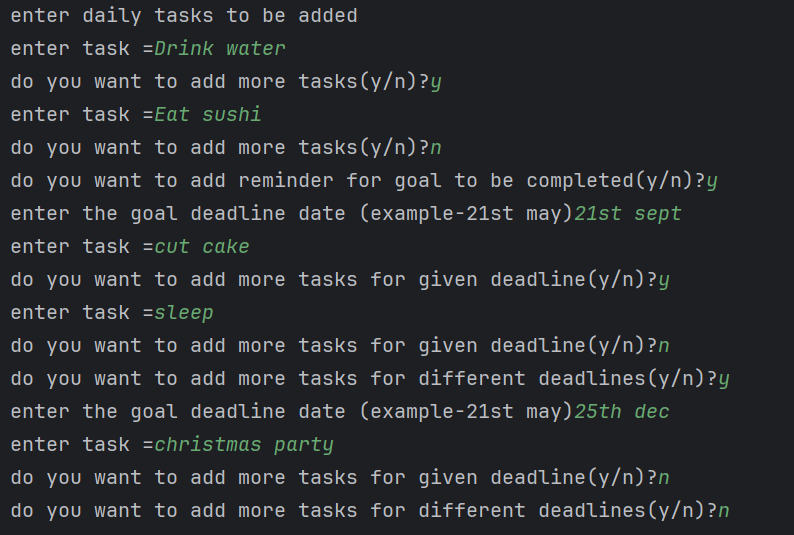
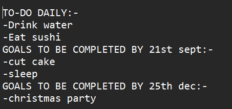

# python-basic-projects:
Just some basic Python projects to get started with the language.
## how to run:
- any of the projects listed below can be run using python  
- install python  
- run the file  

# table of contents:
- card_dealer.py  
- To-do_list.py  
## card_dealer.py:
this python program is a card dealing simulation  
you can customize:  
- number of decks to be shuffled  
- number of players  
- number of cards per player  

### features:  
- multiple decks  
- custom number of players  
- prevents over-dealing of cards  

### sample output:

## To-do_list.py:
this python program creates a well organized To-do list with daily tasks and goals to be set for customizable dates.

### features:
- daily tasks  
- goals can be set for any specified date  
- user can set as many tasks and goals as they may need  

### sample output:
  
  
