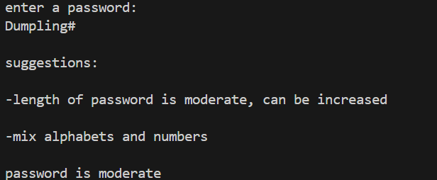

# 🔐Password Strength Analyzer (Python CLI Tool)

A simple command-line based password strength analyzer built using Python.

This tool evaluates a password based on multiple security factors and provides both a strength rating and improvement suggestions.

## 🚀 Features

✅ Length-based scoring

✅ Uppercase & lowercase mix detection

✅ Alphabet & number mix detection

✅ Special character detection

✅ Strength classification:

Weak

Moderate

Strong

Very Strong

✅ Suggests improvements if requirements are not met

## 🧠 Scoring Logic

The password is scored based on:

Length:

< 8 → 0 points

8–11 → 1 point

12+ → 2 points

Special Characters:

1–2 → +1 point

3+ → +2 points

Uppercase + Lowercase mix → +2 points

Alphabet + Number mix → +1 point

Final score determines strength level.

# EXAMPLE OUTPUT:

